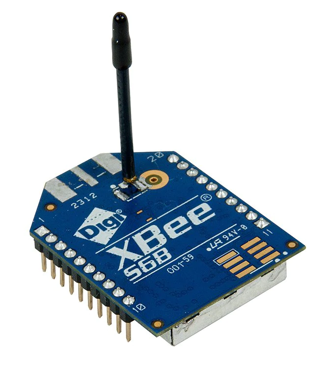

# Mobile et IoT

## Projet "Dress for your weather"

Il s'agit d'un projet de station météo pour permettre la proposition de style d'habillement en temps réel.

- Une présentation est PDF disponible [ici](docs/Presentation_Dress_for_your_weather_Station_meteo.pdf).
- Une presentation vidéo est disponible [ici](#) (à venir).

## Arborescence essentielle

### Codes source Arduino

```
├── arduino
```

### Codes source Docs

```
├── docs
```

### Codes source ReactApp Web

```
├── reactapp
```
### Codes source ReactApp Mobile
```
├── reactmobile
```

### Codes source Router

```
├── router
```

### Codes source Socket

```
├── socket
```

### Captures de la configuration du réseau XBee

```
└── xbee_reseau
```

## Devices utilisé

- 1x Arduino Uno


- 1x Arduino Mega


- 3x XBee



## Arborescence complète

```
.
├── README.md
├── arduino
│   ├── Readme.md
│   ├── _aides_arduino_pdf
│   │   ├── 001_cours-gratuit.com--id-10519.pdf
│   │   └── 002_cours-gratuit.com--id-10475.pdf
│   ├── _readme_img
│   │   ├── 001.jpg
│   │   ├── 002.jpg
│   │   ├── 003.jpg
│   │   ├── 004.jpg
│   │   ├── 005_potentionmetre.jpg
│   │   ├── 006_temperature-humidity-sensor.jpg
│   │   └── IMG_5503.jpg
│   ├── demos_codes
│   │   ├── demo_1
│   │   │   └── demo_1.ino
│   │   ├── demo_2
│   │   │   └── demo_2.ino
│   │   ├── demo_3
│   │   │   └── demo_3.ino
│   │   ├── demo_4
│   │   │   └── demo_4.ino
│   │   ├── demo_5
│   │   │   └── demo_5.ino
│   │   ├── demo_6
│   │   │   └── demo_6.ino
│   │   ├── demo_7
│   │   │   └── demo_7.ino
│   │   ├── projet
│   │   │   └── projet.ino
│   │   └── projet_ok
│   │       └── projet_ok.ino
│   └── projet_complet
│       ├── station_de_temperature_et_humidite
│       │   └── station_de_temperature_et_humidite.ino
│       └── station_de_vent
│           └── station_de_vent.ino
├── docs
│   └── Presentation_Dress_for_your_weather_Station_meteo.pdf
├── reactapp
│   ├── App.js
│   ├── app.json
│   ├── assets
│   │   ├── adaptive-icon.png
│   │   ├── favicon.png
│   │   ├── icon.png
│   │   └── splash.png
│   ├── babel.config.js
│   ├── components
│   │   ├── service
│   │   │   └── Firebase.js
│   │   └── view
│   │       ├── ButtonUpdate.js
│   │       ├── DataCell.js
│   │       ├── MainApp.js
│   │       └── Title.js
│   └── package.json
├── reactmobile
│   ├── App.js
│   ├── app.json
│   ├── assets
│   │   ├── adaptive-icon.png
│   │   ├── favicon.png
│   │   ├── icon.png
│   │   └── splash.png
│   ├── babel.config.js
│   ├── components
│   │   └── view
│   │       ├── MainApp.js
│   │       └── Title.js
│   └── package.json
├── router
│   ├── package.json
│   ├── server.js
│   └── storage.js
├── socket
│   ├── Dockerfile
│   ├── README.md
│   ├── package.json
│   ├── server.js
│   ├── sniffer
│   │   └── README.md
│   └── storage.js
└── xbee_reseau
    ├── 003_1_coordinator_et_routers.png
    ├── 003_2_routers.png
    ├── 004_coordinator.png
    ├── 005_coordinator.png
    ├── 006_router_1_1.png
    ├── 006_router_1_2.png
    ├── 006_router_2_1.png
    └── 006_router_2_2.png

30 directories, 63 files
```